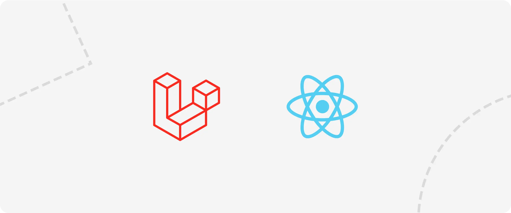
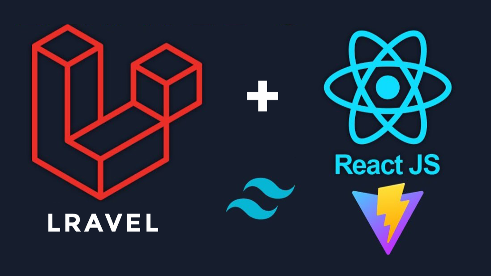
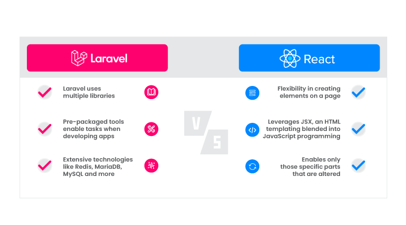
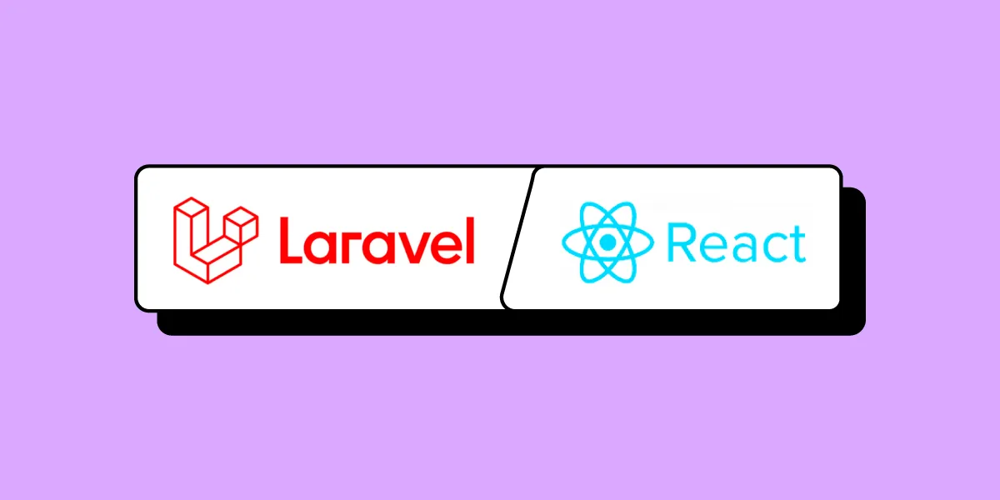

# React Laravel Starter Kit



**The Future of Full-Stack Development: Fully Decoupled, Unparalleled Flexibility**

A production-ready starter kit that separates React frontend and Laravel backend into independent, scalable applications. Perfect for modern development teams that need the freedom to deploy, scale, and maintain frontend and backend separately—without the constraints of traditional monolithic frameworks.

**DEMO**: [bjornleonhenry.com](https://rlsk.bjornleonhenry.com)

## Why Choose This Architecture?

This starter kit embraces a **fully decoupled architecture** where frontend and backend operate as independent applications communicating through REST APIs. Unlike traditional Laravel setups with Inertia.js, this approach offers unparalleled flexibility for modern development teams.

### The Power of Decoupled Architecture

Laravel Sanctum and Fortify make authentication with separate frontends possible—but not always simple. This kit handles the complex CORS, session domains, and cross-origin cookie configurations for you, so you can focus on building features rather than fixing configuration headaches.

**Perfect for projects where:**
- Teams have dedicated frontend and backend developers
- Frontend needs to be deployed independently (S3, Vercel, Netlify)
- Multi-domain deployments are required
- Maximum flexibility and separation of concerns is desired

### API-First Benefits Over Inertia.js

While Inertia.js excels at bridging Laravel and React/Vue for full-stack developers, this decoupled approach shines when you need true separation between frontend and backend teams and deployments.

| Feature / Concern | **Inertia.js** | **Decoupled API (This Kit)** |
|------------------|----------------|------------------------------|
| **Architecture** | Tightly coupled frontend/backend | Fully separated, independent applications |
| **Routing** | Laravel handles all routing | React Router manages frontend routing |
| **Deployment** | Monolithic deployment | Independent frontend/backend deployments |
| **Team Structure** | Full-stack Laravel teams | Separate frontend/backend specialists |
| **API Communication** | Implicit via Laravel controllers | Explicit REST/JSON APIs with clear contracts |
| **Frontend Hosting** | Served via Laravel | Deploy anywhere (S3, Vercel, Netlify, etc.) |
| **Frontend Flexibility** | Bound to Laravel lifecycle | 100% JavaScript stack freedom |
| **SSR Support** | Built-in via Laravel | Optional (Next.js, Remix, etc.) |
| **Learning Curve** | Lower for Laravel devs | Requires API design knowledge |
| **Scaling** | Vertical scaling with Laravel | Independent horizontal scaling |
| **Technology Stack** | Laravel-centric | Technology-agnostic frontend |

**When to Choose Inertia:**
- Small to medium teams with full-stack Laravel developers
- Rapid prototyping and MVP development
- Projects where SSR is critical
- Simpler deployment requirements

**When to Choose This Kit:**
- Large teams with specialized frontend/backend roles
- Complex applications requiring independent scaling
- Projects needing multi-platform frontends (web, mobile, desktop)
- Enterprise environments with separate deployment pipelines
- Maximum flexibility in technology choices

### Real-World Benefits

**For Development Teams:**
- Frontend developers work in pure JavaScript/TypeScript environment
- Backend developers focus solely on API logic without frontend concerns
- Independent deployment cycles reduce coordination overhead
- Technology choices aren't constrained by framework limitations

**For Deployment:**
- Frontend can be deployed to CDN (Netlify, Vercel) for optimal performance
- Backend scales independently based on API load
- Zero-downtime deployments for frontend changes
- Multi-environment support (staging, production, etc.)

**For Maintenance:**
- Clear API contracts prevent breaking changes
- Frontend and backend can be updated independently
- Easier testing of individual components
- Simplified debugging with clear separation of concerns

## Architecture

This project follows a decoupled architecture with separate frontend and backend applications:

### Backend (Laravel)
- **Framework**: Laravel 12+ with PHP 8.2+
- **Authentication**: Laravel Sanctum + Fortify
- **Admin Panel**: Filament v4+
- **Database**: SQLite (development) / configurable for production
- **API**: RESTful API endpoints

### Frontend (React)
- **Framework**: React 19 with React Router v7
- **Language**: TypeScript
- **Styling**: Tailwind CSS with custom components
- **State Management**: Zustand
- **UI Components**: Radix UI primitives with custom styling
- **Forms**: React Hook Form with validation

### Infrastructure
- **Containerization**: Docker + Docker Compose
- **Development**: Hot reload, volume mounting
- **Production**: Optimized builds with nginx
- **Database**: SQLite with persistent volumes

## Key Features

- **Fully Decoupled Architecture** - Frontend and backend as independent applications
- **Modern React Stack** - React 19, TypeScript, React Router v7, Tailwind CSS
- **Laravel 12+ Backend** - Latest Laravel with Filament admin panel
- **Complete Authentication** - Registration, login, password reset, 2FA
- **RESTful API Design** - Clean, documented API endpoints
- **Docker Development** - One-command setup with hot reload
- **Production Ready** - Optimized builds and deployment configs
- **Admin Dashboard** - Beautiful Filament admin interface
- **Automated Scripts** - Bash scripts for common development tasks
- **Type Safety** - Full TypeScript coverage on frontend

## Screenshots

### Frontend Interface

*The modern React interface built with Tailwind CSS and TypeScript*

### Laravel Admin Panel

*Beautiful Filament admin panel for content management*

### Application Architecture

*Decoupled architecture with independent frontend and backend deployments*

## Project Layout

```
.
├── backend/                 # Laravel application
│   ├── app/                # Application code
│   ├── config/             # Configuration files
│   ├── database/           # Migrations and seeders
│   ├── routes/             # API and web routes
│   ├── resources/          # Views and assets
│   └── public/             # Public assets
├── frontend/               # React application
│   ├── app/                # Application code
│   ├── public/             # Static assets
│   └── components.json     # UI component configuration
├── docker/                 # Docker configuration
├── scripts/                # Automation scripts
├── docs/                   # Documentation
└── run.sh                  # Main runner script
```

## Quick Start

### Prerequisites

- Git
- Docker and Docker Compose
- PHP 8.2+
- Composer
- Node 18+

### Installation

1. **Clone the repository**
   ```bash
   git clone https://github.com/bjornleonhenry/react-laravel-starter-kit.git
   cd react-laravel-starter-kit
   ```

2. **Run the setup script**
   ```bash
   ./run.sh setup
   ```

   This will:
   - Install backend dependencies (Composer)
   - Install frontend dependencies (npm)
   - Set up environment files
   - Initialize the database
   - Build frontend assets

3. **Start the development environment**
   ```bash
   ./run.sh
   ```

   Or start services individually:
   ```bash
   # Full stack
   docker-compose up --build

   # Frontend only
   cd frontend && docker-compose up --build

   # Backend only
   docker-compose up backend db --build
   ```

4. **Access the applications**
   - Frontend: http://localhost:3000
   - Backend API: http://localhost:8000
   - Admin Panel: http://localhost:8000/admin

## Development Workflow

### Using the Runner Script

The `run.sh` script provides convenient commands for common tasks:

```bash
# Interactive menu
./run.sh

# Setup project
./run.sh setup

# Update dependencies
./run.sh update

# Build for production
./run.sh build

# Run tests
./run.sh check

# Database operations
./run.sh migrate

# Code optimization
./run.sh optimize
```

### Manual Development

#### Backend Development
```bash
cd backend
composer install
cp .env.example .env
php artisan key:generate
php artisan migrate
php artisan serve
```

#### Frontend Development
```bash
cd frontend
npm install
npm run dev
```

### Docker Development

The project includes comprehensive Docker setup for development and production.

#### Development Environment
- Hot reload enabled
- Volume mounting for live code changes
- Development tools and debugging

#### Production Environment
```bash
docker-compose --profile production up --build
```

## Authentication

The application includes complete authentication system:

### Features
- User registration and login
- Password reset functionality
- Two-factor authentication support
- API token management (Sanctum)
- Session management

### Admin Panel
- User management interface
- Role-based access control
- Admin dashboard with Filament

## API Documentation

### Authentication Endpoints
- `POST /api/login` - User login
- `POST /api/register` - User registration
- `POST /api/logout` - User logout
- `POST /api/forgot-password` - Password reset request

### User Management
- `GET /api/user` - Get authenticated user
- `PUT /api/user/profile` - Update user profile
- `PUT /api/user/password` - Change password

## Deployment

### Production Setup

1. **Environment Configuration**
   ```bash
   # Copy and configure environment files
   cp .env.example .env
   # Edit .env with production values
   ```

2. **Database Setup**
   ```bash
   # For production, consider PostgreSQL or MySQL
   # Update .env DB_CONNECTION accordingly
   ```

3. **Build and Deploy**
   ```bash
   ./run.sh build
   docker-compose --profile production up -d
   ```

### Environment Variables

#### Backend (.env)
```env
APP_NAME="React Laravel Starter Kit"
APP_ENV=production
APP_KEY=your_app_key
APP_DEBUG=false
APP_URL=http://localhost

DB_CONNECTION=sqlite
DB_DATABASE=database/database.sqlite

# Or for other databases:
# DB_CONNECTION=mysql
# DB_HOST=127.0.0.1
# DB_PORT=3306
# DB_DATABASE=laravel
# DB_USERNAME=user
# DB_PASSWORD=password
```

#### Frontend (.env)
```env
VITE_API_URL=http://localhost:8000/api
```

## Contributing

1. Fork the repository
2. Create a feature branch
3. Make your changes
4. Run tests: `./run.sh check`
5. Submit a pull request

## License

This project is licensed under the MIT License - see the LICENSE file for details.

## Support

For questions and support:
- Documentation: [docs/README-DOCKER.md](docs/README-DOCKER.md)
- Issues: GitHub Issues
- Website: https://bjornleonhenry.com

---

**Author**: Bjorn Leon Henry
**Website**: [bjornleonhenry.com](https://bjornleonhenry.com)